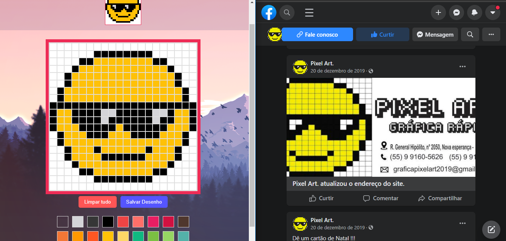

<div align="center">
  
  	
  
  
</div>
 
<h2 align="center">Pixel Paint</h2>

<p align="center">
Um simples programa de Pixel Paint
  <br/>
  <a href="https://pixel-paint-ecru.vercel.app/"><strong>Acessar demonstração</strong></a>
</p>

### Imagem do projeto
Carinha feliz baseado em um pixel Art que encontrei no Facebook.


### Projeto
Para executar o projeto é preciso instalar as dependências e executar o comando abaixo  
```bash
npm run dev
```
Então é só abrir o [http://localhost:3000](http://localhost:3000) para ver a aplicação rodando.
